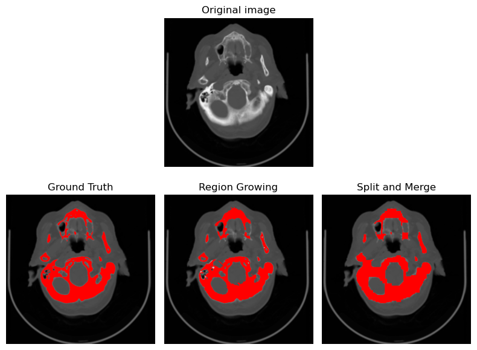
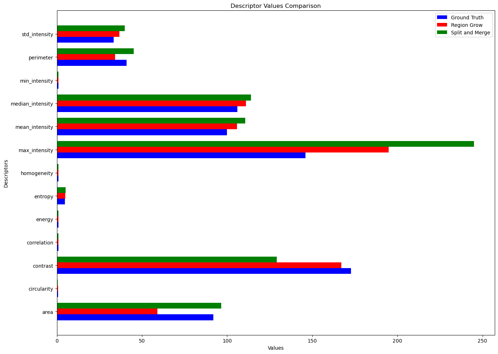

## TC Image Segmentation Analysis with Region Growing and Split & Merge Techniques

### Project Overview
This repository houses an advanced Bioinformatics project focused on the application of two primary segmentation techniques—Region Growing and Split & Merge—on neuroimaging data, specifically TC scans. My objective is to segment various bone structures accurately, providing a detailed comparison of these algorithm's performance. 

### Technical Description
At the core of this project are the Region Growing and Split & Merge algorithms, which have been meticulously applied to TC (Tomography) images to capture the intricate details within. I delve into the texture and shape descriptors to quantify the segmentation quality, drawing upon the robust Dice coefficient for an objective performance measure. I employ Python, to manipulate and analyze the imaging data. The segmentation results are instrumental in determining the algorithms' efficacy and could be pivotal in clinical applications.

### Visualizations and Results
The repository also includes a series of visual aids and graphical representations that elucidate the segmentation process and outcomes.

